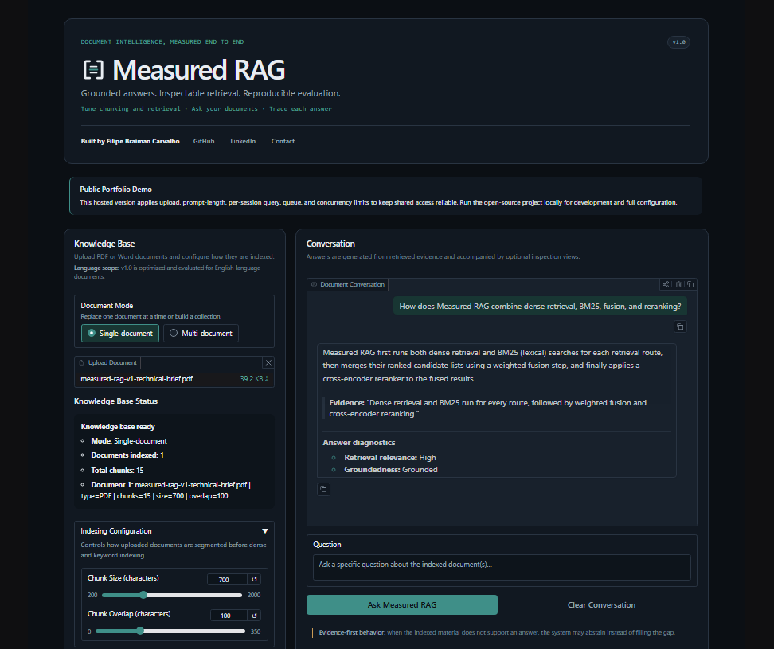
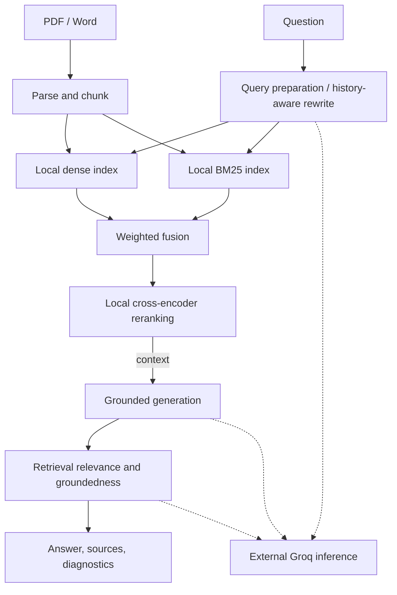
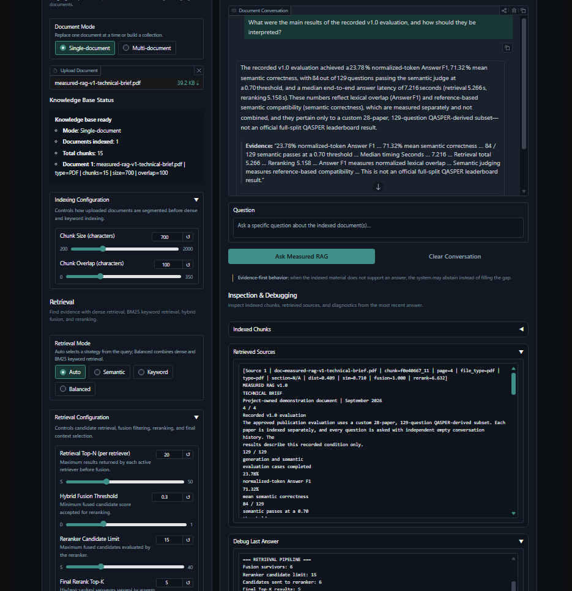

# Measured RAG

**Grounded answers. Inspectable retrieval. Reproducible evaluation.**

[Try the live demo](https://demo.measured-rag.com) — a constrained public
portfolio demonstration of a production-style document RAG system, not an
enterprise production service.

[](assets/screenshots/measured-rag-demo-final.mp4)

[Watch the one-minute demonstration](assets/screenshots/measured-rag-demo-final.mp4)

Measured RAG turns PDF and Word documents into an inspectable question-answering
workflow. It makes ingestion, retrieval decisions, supporting evidence,
diagnostics, telemetry, configuration, and evaluation visible instead of hiding
the pipeline behind a chat interface.

## More than a basic RAG chatbot

Every retrieval route runs dense search and BM25, combines candidates through
weighted hybrid fusion, and applies cross-encoder reranking before generation.
The system can rewrite questions using recent conversation context, restrict
retrieval to selected documents, abstain when supplied evidence is insufficient,
and expose the chunks and rankings behind each response. Its benchmark harness
reuses the application's runtime services rather than maintaining a parallel RAG path.

### Core features

- PDF, DOC, and DOCX ingestion with single- and multi-document workflows
- Configurable character-window chunking and document-scope controls
- Auto, Semantic, Keyword, and Balanced hybrid retrieval routes
- Dense retrieval, BM25, weighted fusion, and local cross-encoder reranking
- History-aware query rewriting and evidence-grounded answer generation
- Indexed chunks, retrieved sources, and last-answer debug inspection
- Retrieval-relevance and groundedness diagnostics as operational signals
- Mode-specific structured telemetry with documented privacy boundaries
- Reproducible evaluation workflow with curated publication artifacts

### Technology stack


## Architecture



Embedding and reranking run locally; query rewriting, answer generation, and
runtime diagnostic judgments cross the external Groq boundary. See
[Architecture](docs/architecture.md) for the full application and benchmark
design.

## Canonical v1.0 benchmark

The publication run measured a custom 28-paper, 129-question QASPER-derived
subset under a single-document condition, with independent empty-history
questions.

| Measure | Recorded result |
| --- | ---: |
| Generation coverage | 129/129 |
| Normalized-token Answer F1 | 23.78% |
| Semantic-evaluation coverage | 129/129 |
| Mean semantic correctness | 71.32% |
| Semantic passes | 84/129 (65.12%) at the recorded 0.70 threshold |

Answer F1 and semantic correctness measure different properties and are not
combined. This is not an official full-split QASPER leaderboard result. The
results apply only to the recorded configuration, models, subset, and judge.
Evidence F1 is not reported because retrieved chunks were not mapped to official
QASPER evidence units.

[Read the interpretation](docs/benchmark-results.md) ·
[Review the methodology](docs/benchmarking.md) ·
[Inspect the curated publication report](benchmarking/publication/qasper-publication-v1-28p/evaluation_report.md)



## Representative interaction

> **Question:** How does Measured RAG combine dense retrieval, BM25, fusion, and
> reranking?
>
> **Answer:** Measured RAG runs dense retrieval and BM25 for every route,
> combines their ranked candidates through weighted fusion, and then applies
> cross-encoder reranking to determine the final context order.

The interface also exposes the supporting passage and the retrieval-relevance
and groundedness diagnostics. This example illustrates the workflow; it is not
benchmark evidence. Try it with the project-owned
[Measured RAG v1.0 technical brief](assets/sample_documents/measured-rag-v1-technical-brief.pdf).

## Quick start

The application supports CPython 3.11. From Windows PowerShell:

```powershell
git clone https://github.com/filipe-braiman/measured-rag.git
Set-Location measured-rag
py -3.11 -m venv .venv
.\.venv\Scripts\Activate.ps1
python -m pip install --upgrade pip
python -m pip install -r requirements.txt
Copy-Item .env.example .env
```

Edit `.env`, set `GROQ_API_KEY` to your provider credential, and keep
`DEPLOYMENT_MODE=local`. Then start the interface:

```powershell
python app.py
```

Open the address printed at launch; the default starting address is
`http://127.0.0.1:7860`. Initial startup downloads and caches the local embedding
and reranking models. See [Development](docs/development.md) and
[Configuration](docs/configuration.md) for complete setup and environment
guidance. Evaluation uses a separate environment described in
[Benchmarking](docs/benchmarking.md).

## Local and hosted modes

| Concern | Local application | Hosted public demo |
| --- | --- | --- |
| Intended use | Local development, configuration, and experimentation | Shared, constrained portfolio demonstration |
| Shared-demo guardrails | Cloud-specific budgets are not applied; machine and provider limits still apply | Expensive indexing and chat work are serialized per process; queue capacity is 20 |
| Upload/document limits | PDF, DOC, DOCX; no cloud document or byte budgets | Up to 3 documents, 10 MiB per file, and 20 MiB accumulated uploads |
| Question limits | No cloud character or session allowance | 2,000 characters; 5 admitted questions per session |
| Telemetry boundary | Content-bearing JSONL can include questions, answers, filenames, source previews, and identifiers | Application telemetry excludes document and conversation content and identifiers; platform, dependency, and provider policies remain separate |
| Persistence/privacy boundary | Application state remains under the local operator's control, but local telemetry is content-bearing and provider requests still send role-specific content externally. | No durable knowledge base, account isolation, confidentiality, or guaranteed deletion; do not upload sensitive documents |
| Configuration flexibility | Full interactive controls without hosted budgets | Same core workflow and controls, with fixed hosted guardrails |

## Documentation

| Document | Responsibility |
| --- | --- |
| [Architecture](docs/architecture.md) | System flow, component boundaries, model execution, and design rationale |
| [User guide](docs/user-guide.md) | Local and hosted workflows, controls, inspection, diagnostics, and resets |
| [Configuration](docs/configuration.md) | UI parameters, environment settings, models, defaults, and limits |
| [Deployment](docs/deployment.md) | Container and Cloud Run architecture, hosted operation, and smoke checks |
| [Benchmarking](docs/benchmarking.md) | Dataset construction, staged evaluation, scoring, artifacts, and recovery |
| [Benchmark results](docs/benchmark-results.md) | Qualified interpretation of the canonical v1.0 publication run |
| [Development](docs/development.md) | Local setup, dependency boundaries, tests, and project structure |
| [Limitations](docs/limitations.md) | Validated scope, privacy boundaries, and known tradeoffs |
| [Telemetry](docs/telemetry.md) | Runtime event contracts, diagnostic semantics, and safe handling |
| [Security](SECURITY.md) | Supported release scope and private vulnerability reporting |
| [Contributing](CONTRIBUTING.md) | Contribution workflow, test expectations, and review requirements |
| [Third-party notices](THIRD_PARTY_NOTICES.md) | Dependency, model, QASPER, and asset attribution |
| [License](LICENSE) | GNU Affero General Public License version 3 text |

## Validated scope and limitations

**Measured RAG v1.0 is optimized and evaluated for English-language documents.**

- Scanned or image-only PDFs have no OCR fallback.
- Images, figures, tables, formulas, and layout relationships are not interpreted
  beyond extracted text.
- Retrieval and generation can fail, omit information, or produce incorrect
  answers; displayed sources are inspectable evidence, not formal citation
  verification.
- Retrieval-relevance and groundedness diagnostics are operational signals, not
  correctness guarantees.
- Do not upload confidential, regulated, personally identifiable, or otherwise
  sensitive documents to the hosted demo.
- Local use is not fully offline because external-provider calls remain
  necessary.

See [Limitations](docs/limitations.md) for the complete operating boundary.

## Roadmap

Potential future directions include multilingual retrieval evaluation, OCR and
layout-aware parsing, stronger table and figure handling, human-calibrated
diagnostics, broader multi-document evaluation, authentication and durable
deployment controls, and further retrieval and configuration experiments. These
are directions for exploration, not committed features or release dates.

## Author, acknowledgements, and license

**Developed** by [Filipe Braiman Carvalho](https://github.com/filipe-braiman) ·
[LinkedIn](https://linkedin.com/in/filipe-b-carvalho) ·
[Email](mailto:filipebraiman@gmail.com)

Measured RAG uses a QASPER-derived evaluation subset. QASPER was introduced by
Pradeep Dasigi, Kyle Lo, Iz Beltagy, Arman Cohan, Noah A. Smith, and Matt
Gardner; see the [canonical paper record](https://aclanthology.org/2021.naacl-main.365/)
and [third-party notices](THIRD_PARTY_NOTICES.md). QASPER's CC BY 4.0 terms do
not cover independently authored research PDFs.

Copyright (C) 2026 Filipe Braiman Carvalho

Project-owned code is licensed under [GNU AGPL version 3 only](LICENSE).
Third-party components and attribution are documented in
[THIRD_PARTY_NOTICES.md](THIRD_PARTY_NOTICES.md), including the recorded PyMuPDF
licensing information.
