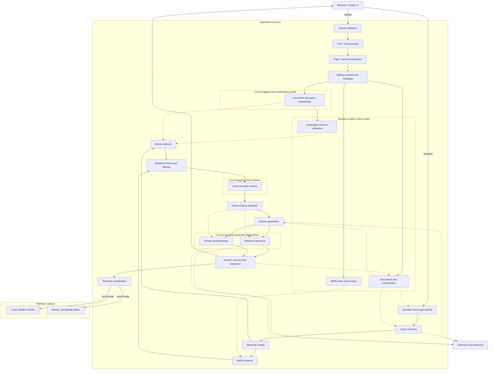
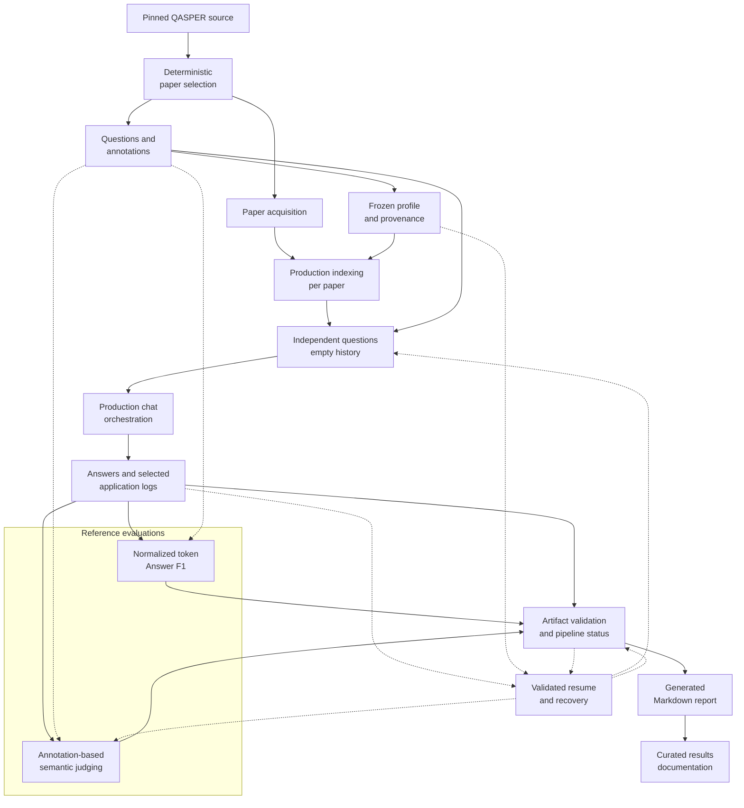

# Architecture

Measured RAG is a lightweight, production-style document retrieval-augmented
generation (RAG) system. It combines document indexing, hybrid retrieval,
reranking, evidence-directed answers, runtime diagnostics, and a benchmark
pipeline that exercises the same application services.

This page explains component boundaries, data flow, and engineering tradeoffs.
Detailed controls, installation, deployment procedures, and benchmark results
belong in their respective guides rather than this architecture overview.

## System overview

The application runs a Gradio interface and the RAG services in one Python
process. Uploaded documents become chunks indexed in an embedded Chroma
collection and a BM25 keyword index. A question is rewritten, retrieved against
both indexes, and reranked before selected passages are sent to an external
language model. Two post-generation checks assess retrieval relevance and answer
groundedness; the interface exposes the answer, sources, and execution details.

[`app.py`](../app.py) owns UI construction, event wiring, shared model
initialization, and launch. [`chat/service.py`](../chat/service.py) owns query
orchestration. Ingestion and retrieval are separate services so that
[`benchmarking/generate_answers.py`](../benchmarking/generate_answers.py) can
exercise them without driving a browser or importing the application entry point.

## Application architecture

Solid arrows show data flow or execution dependencies. Dotted arrows show state
access, model use, or external inference calls. The retrieval branches are shown
separately for clarity; the current service calls dense retrieval and then BM25.
Only the two diagnostic checks are explicitly concurrent.

The output node groups response assembly and inspection, not a separate service.
The successful query path logs its record before returning the UI outputs.
Chroma belongs to the application runtime; the diagram does not represent a
managed database or durable cloud knowledge base.

## Request lifecycle

### 1. Document ingestion

The upload callback accepts PDF, DOC, and DOCX files. Hosted guardrails check
file availability, extension, and upload budgets before indexing. These are
callback checks on server-side upload paths, not a claim about network ingress
limits. The loader also rejects unsupported extensions.

[`ingestion/loaders.py`](../ingestion/loaders.py) uses `PyMuPDFLoader` for PDF
text, preserving page attribution and converting page numbers to one-based
values. Word loading uses `UnstructuredWordDocumentLoader` in element mode:
detected titles and headers delimit sections, and body elements are assembled
under the current header. Word attribution uses the document and available
section header, without assigning PDF-style page numbers. The container supplies
LibreOffice for the legacy DOC conversion path.

[`ingestion/chunking.py`](../ingestion/chunking.py) processes PDF pages and
Word section groups separately. Text normalization and sliding windows live in
[`ingestion/text_processing.py`](../ingestion/text_processing.py). Chunk size
is a target character window: whitespace boundaries, long words, and final
fragments affect emitted lengths. The algorithm validates overlap and ensures
forward progress rather than assuming every boundary permits the requested
overlap. The UI also adjusts its overlap control in
[`ui/controls.py`](../ui/controls.py).

### 2. Index construction

[`ingestion/metadata.py`](../ingestion/metadata.py) assigns document and chunk
identifiers, source names, file types, fingerprints, and available page or
section information. It filters metadata to supported fields and value types.

[`ingestion/indexing.py`](../ingestion/indexing.py) creates a randomly named
Chroma collection for the knowledge base and adds chunks using the shared local
embedding model. It also retains the chunk objects and rebuilds a `BM25Okapi`
index from whitespace-split chunk text. Chroma is instantiated without an
explicit persistence directory or remote server configuration.

Single-document indexing replaces the current knowledge base. Multi-document
indexing appends documents and skips duplicates with the same content
fingerprint, chunk size, and overlap. Changing chunk settings can therefore make
the same file a distinct indexing input. Upload coordination and conversation
reset behavior are separate from indexing itself.

### 3. Query preparation

The UI submission helper trims questions and applies hosted admission checks.
[`chat()`](../chat/service.py) returns early for empty input, a missing knowledge
base, or an empty selected-document scope. Scope selection resolves all indexed
documents or selected filenames into document IDs.

For each query that passes these checks,
[`generation/query_rewriter.py`](../generation/query_rewriter.py) attempts an
external rewrite using recent conversation messages. This also happens with
empty history; it is not an optional UI feature. Empty or failed rewrite output
falls back to the original question. Retrieval uses the rewritten query, while
answer generation receives the original question.

### 4. Retrieval and fusion

Both dense and BM25 retrieval participate in every current retrieval mode.
[`retrieval/routing.py`](../retrieval/routing.py) chooses their fusion weight:
**Semantic** uses a dense weight of 0.80, **Keyword** 0.45, and **Balanced** 0.65.
**Auto** selects among those routes using query length, digits, capitalization,
quotation marks, and English question starters. These are weighted hybrid routes,
not switches that disable a retriever.

Scope filtering differs between the implementations:

- [`retrieval/dense.py`](../retrieval/dense.py) requests the collection's top
  results and then removes documents outside the selected scope. Relevant
  in-scope passages below that initial cutoff are not recovered by this step.
- [`retrieval/bm25.py`](../retrieval/bm25.py) scores the indexed corpus, filters
  to the allowed document IDs, and then selects its top results.

[`retrieval/fusion.py`](../retrieval/fusion.py) converts dense distances to
similarities and min-max normalizes them. BM25 scores are normalized within its
selected candidates. Fusion joins candidates by chunk ID and combines normalized
scores as `alpha * dense + (1 - alpha) * BM25`, with a missing contribution set
to zero. Candidates below the fusion threshold are removed. These scores rank
the available candidates; they are not calibrated probabilities of relevance.

### 5. Reranking and context selection

Fusion filtering and reranking are distinct stages. The service first limits the
fusion survivors sent to the reranker, ensuring that the effective candidate
limit is at least the requested final Top-K.

[`retrieval/reranking.py`](../retrieval/reranking.py) evaluates rewritten-query
and passage pairs with a local cross-encoder, which considers each pair jointly.
Passages include their source context through
[`retrieval/formatting.py`](../retrieval/formatting.py). The highest reranker
scores determine the final evidence selection; fewer passages are returned if
fewer candidates survive. Reranking cannot recover a passage excluded upstream.

### 6. Answer generation and attribution

[`generation/answer_generator.py`](../generation/answer_generator.py) assembles
the selected passages, recent conversation history, and original question using
[`generation/prompt.py`](../generation/prompt.py). The prompt directs the model
to answer from supplied evidence, use history only to resolve references, provide
a short supporting excerpt, and abstain when the evidence is insufficient.
These instructions do not guarantee correctness, groundedness, or exact quoting.

The provider response must contain one usable answer choice. Empty content and
answers truncated at the completion-token limit raise `AnswerGenerationError`.
There is no automatic answer-repair loop driven by the subsequent diagnostics.

[`utils/source_formatter.py`](../utils/source_formatter.py) independently
formats the retrieved passages with document names, chunk IDs, page or section
attribution, and retrieval/reranking scores. This lets a reader inspect the
evidence actually supplied, alongside the model's generated excerpt.

### 7. Post-generation diagnostics

After answer generation, `chat()` runs two checks concurrently and waits for
their results:

- **Retrieval relevance** asks whether the selected passages help answer the
  rewritten query. [`retrieval/relevance.py`](../retrieval/relevance.py) uses an
  external LLM to assign passage scores, an overall label, and an explanation.
  Local arithmetic then computes a rank-weighted numeric score from the first
  five passage positions at most. This arithmetic is not a separate non-LLM
  relevance judge; its inputs are model judgments.
- **Groundedness** checks the original question and generated answer against the
  selected context. [`generation/groundedness.py`](../generation/groundedness.py)
  returns `grounded`, `partially_grounded`, or `not_grounded` with an explanation.

Provider failures or malformed results become `unknown`, meaning the diagnostic
is unavailable. When there is no retrieved context, the implementations return
`low` relevance and `not_grounded` without making those checker calls. Neither
diagnostic compares the answer with a reference answer or measures reference
correctness. Labels are appended to the response, not used to revise it.

### 8. Telemetry and inspection

The interface exposes **Indexed Chunks**, **Retrieved Sources**, and **Debug Last
Answer**. The debug builder includes the original and rewritten queries, routing,
candidate counts, ranking information, final prompt, diagnostics, timings, and
available token usage. Inspection is constructed on the normal answer path;
the retained `debug_enabled` service argument does not gate its construction.
See [`debug/builder.py`](../debug/builder.py) and
[`ui/view_toggles.py`](../ui/view_toggles.py).

[`telemetry/logger.py`](../telemetry/logger.py) deliberately separates two
logging policies. Local mode appends detailed records to
`answer_logs/rag_eval_log.jsonl`, including queries, answers, source previews,
filenames, diagnostics, and operational measurements. Cloud mode emits
allowlisted operational JSON to stdout: settings, counts, diagnostic labels,
timings, and token totals, without query text, answer text, filenames, source
previews, or conversation identifiers. Cloud serialization failure produces a
generic event rather than falling back to detailed local logging.

This boundary applies to the application's telemetry serializer. It does not
establish the content or retention policy of every dependency, platform log, or
external inference service. See [Telemetry and diagnostics](telemetry.md) for
the complete event, field, interpretation, and privacy contract.

## State and lifecycle

Gradio state holds each session's knowledge-base reference, conversation history,
document selection inputs, pending question, and query count. The knowledge base
contains document metadata, its Chroma collection, BM25 index, and chunks.
Embedding and reranker instances are shared process-level caches. This is
application-level session separation, not a formal tenancy, security, or
confidentiality guarantee.

[`core/state.py`](../core/state.py) owns knowledge-base reset and best-effort
Chroma collection deletion. [`ui/upload.py`](../ui/upload.py) and
[`ui/reset.py`](../ui/reset.py) determine which UI actions invoke those operations:

| Action | Knowledge base | Conversation |
| --- | --- | --- |
| Replace the single document through the UI | Previous knowledge base reset, then new document indexed | Cleared; new conversation ID created during the empty-uploader reset |
| Append documents in multi-document mode | Extended, with duplicate checks | Retained; source/debug outputs cleared |
| Empty uploader or remove a file from the multi-document uploader | Entire knowledge base reset | Cleared; new conversation ID |
| Change document mode | Reset | Cleared; new conversation ID |
| Clear Conversation | Retained, including indexed chunks | Cleared; new conversation ID |

The hosted query allowance belongs to session state; conversation and document
resets do not replenish it. Admission occurs before downstream generation, so
an accepted submission need not produce an answer to consume allowance.

Uploaded-file paths remain in document metadata. Collection deletion does not
delete those uploaded files, and its failures are suppressed. The application
does not implement a verified upload-retention period or guaranteed cleanup on
session expiry. Users should not treat a reset as proof of file erasure.

## Local models and external services

Model roles come from [`config.py`](../config.py) and request construction in
[`core/models.py`](../core/models.py):

| Role | Model | Execution |
| --- | --- | --- |
| Embedding | `BAAI/bge-small-en-v1.5` | Local Hugging Face model; normalized document/query embeddings |
| Reranking | `cross-encoder/ms-marco-MiniLM-L6-v2` | Local Hugging Face cross-encoder |
| Query rewriting | `openai/gpt-oss-20b` | External Groq inference |
| Answer generation | `openai/gpt-oss-120b` | External Groq inference |
| Retrieval-relevance checking | `openai/gpt-oss-20b` | External Groq inference, followed by local score aggregation |
| Groundedness checking | `openai/gpt-oss-20b` | External Groq inference |

[`core/llm.py`](../core/llm.py) owns the shared Groq client. Relevant questions,
conversation excerpts, retrieved passages, and generated answers cross that
provider boundary according to the role. Running locally does not remove these
external inference calls.

The application initializes the local models at startup and reuses them within
the process. Local constructors specify model IDs without fixed revisions. The
container instead downloads pinned snapshots during its build using
[`deployment/prefetch_models.py`](../deployment/prefetch_models.py), then enables
offline model lookup. New instances still need to load those weights into memory;
no cold-start duration is guaranteed here.

## Local and hosted execution

Both execution modes use the same RAG services. The `cloud` branch adds upload
budgets, question-length and per-session question limits, a bounded Gradio queue,
and a shared concurrency group for upload indexing and chat. These controls act
within an application process; they are not fleet-wide quotas. Local mode does
not apply those cloud-specific budgets. See
[`deployment/guardrails.py`](../deployment/guardrails.py) and the event wiring in
[`app.py`](../app.py).

[`deployment/runtime.py`](../deployment/runtime.py) binds cloud execution to the
platform-provided port with Gradio sharing disabled. The
[`Dockerfile`](../Dockerfile) packages the runtime, local model assets, and Word
conversion dependencies, runs as a non-root user, and provides writable temporary
directories. Benchmark execution is separate from the application image.

This describes the Cloud Run deployment foundation in the repository. Actual
service resources, scaling, retention, and public-domain validation require
deployment evidence; they are not inferred from the Dockerfile or platform
defaults. Sensitive-document handling also depends on provider and platform
policies, beyond the application's telemetry controls.

## Benchmark architecture

The benchmark separates production answer generation from reference-based
evaluation. [`benchmarking/build_eval_data.py`](../benchmarking/build_eval_data.py)
uses a pinned QASPER validation source, filters eligible papers, and selects them
with a fixed shuffle seed. Paper acquisition is a separate download step;
availability does not establish redistribution rights.

[`benchmarking/generate_answers.py`](../benchmarking/generate_answers.py) indexes
one paper through production ingestion, then calls `chat()` with empty history
and a fresh conversation identifier for every question. It neither imports
`app.py` nor drives the Gradio UI. The primary condition therefore covers
single-document questions, not conversational follow-ups or multi-document use.
The harness selects application log records using the recorded starting byte
offset and the run's conversation identifiers, rather than copying unrelated
requests from the global log.

The two correctness branches have different meanings:

- [`benchmarking/evaluate_qasper_f1.py`](../benchmarking/evaluate_qasper_f1.py)
  computes normalized token Answer F1 against human annotations, retaining the
  maximum reference overlap. It adapts QASPER-style normalization and answer
  handling to the application's artifact format.
- [`benchmarking/evaluate_deepeval.py`](../benchmarking/evaluate_deepeval.py)
  judges each valid annotation independently and retains the maximum semantic
  score when its reference judgments succeed. The current semantic judge is
  `qwen/qwen3.8-27b` through Groq, distinct from the runtime diagnostic checkers.
  [`benchmarking/qasper_judge_input.py`](../benchmarking/qasper_judge_input.py)
  supplies that annotation's highlighted evidence, ordinary evidence, or an
  explicit absence marker, following a versioned policy.

Neither branch replaces the other, and no composite score combines them.
Runtime retrieval relevance and groundedness remain auxiliary diagnostics.
Evidence F1 is not computed because retrieved chunks are not mapped to the
QASPER evidence representation.

[`benchmarking/run_pipeline.py`](../benchmarking/run_pipeline.py) orchestrates
stages as subprocesses and validates their artifacts.
[`benchmarking/generate_report.py`](../benchmarking/generate_report.py) produces
the complete run-level Markdown record. Its readiness status concerns the
benchmark run, not licensing, deployment, or total repository-release readiness.
Curated benchmark-results documentation is a downstream publication step, not
an automatically generated pipeline stage.

## Benchmark integrity and reproducibility

[`benchmarking/evaluation_config.py`](../benchmarking/evaluation_config.py)
defines a typed, frozen `EvaluationConfig` and validates values and portable
repository-relative paths. The pre-run configuration lives in
[`benchmarking/evaluation_settings.py`](../benchmarking/evaluation_settings.py).
Application UI defaults and benchmark profile settings are separate contracts.

A **run ID** identifies a generation artifact directory; a **profile name**
identifies its configuration; a **judge ID** identifies a semantic-evaluation
subdirectory. The approved v1.0 generation run is `qasper-publication-v1-28p`,
under `benchmarking/runs/`, with profile `qasper-28p-publication-v1` and judge ID
`qwen3.8-27b-publication-v1`. Exact metrics and publication artifacts are outside
this page's scope. [Benchmarking](benchmarking.md) owns the methodology and
executable workflow; [Benchmark results](benchmark-results.md) owns the canonical
publication-run metrics and interpretation.

Integrity is enforced at several boundaries:

- **Provenance:** manifests record resolved configuration and its SHA-256 digest,
  the QA dataset file digest, and Git commit and dirty state. The QA digest does
  not fingerprint downloaded PDF bytes. A dirty flag records a limitation; it
  does not capture the uncommitted source diff.
- **Coverage:** generation attempts, selected cases, judgments, reference-level
  failures, and checker availability are accounted for separately. Recorded
  generation errors score zero in correctness evaluation; missing selected
  answer records are integrity errors. Judge failures and `unknown` diagnostics
  are not silently treated as successful results.
- **Artifact separation:** generated answers, selected application logs,
  deterministic scores, judge attempts, metrics, manifests, pipeline summaries,
  and the Markdown report remain distinct records.
- **Writes and recovery:** answer and judge attempts use append-only JSONL.
  [`benchmarking/artifact_io.py`](../benchmarking/artifact_io.py) writes snapshots
  beside their targets, flushes them, and atomically replaces targets with bounded
  retries for temporary file locks. A retained temporary pipeline manifest can be
  recovered only after provenance, stage artifacts, and forward progress are
  validated by the pipeline. Recovery is not manual editing of historical scores.
- **Resume:** generation and judge resume validate their recorded settings,
  dataset, identifiers, selection, and attempts before reuse. Targeted failure
  subsets retain selection provenance and remain diagnostic experiments rather
  than replacements for full-run evaluation.

Request pacing and bounded judge retries help control provider load, but cannot
guarantee quota availability. Reproducibility here means an inspectable workflow,
fixed inputs and settings, and recorded provenance. External generation and
semantic judgments can still vary; bit-identical outputs are not promised.

## Design decisions and tradeoffs

| Decision | Benefit | Tradeoff |
| --- | --- | --- |
| Hybrid dense and BM25 retrieval | Combines semantic and lexical matching | Score normalization and routing add configuration complexity; scope filtering is asymmetric |
| Query rewriting | Resolves conversational references for retrieval | Adds a provider call and can change query emphasis; failures fall back to the original question |
| Local embeddings and reranking | Keeps retrieval inference within the application process | Model weights consume startup time and memory |
| External generation and checking | Avoids hosting generation models in the application container | Depends on network access, provider availability, latency, and data-handling policies |
| Session-scoped Chroma collections | Separates knowledge-base references between application sessions | No durable shared knowledge base or formal tenancy guarantee |
| Built-in diagnostics and inspection | Makes retrieved evidence and operational behavior inspectable | Adds checking cost; diagnostic labels are not reference correctness |
| Integrated benchmark pipeline | Evaluates the production indexing and answer path | Requires coverage accounting, provider pacing, and disciplined artifact management |

## Architectural boundaries

v1.0 is optimized and evaluated for English-language documents. Other languages
are not explicitly blocked, but multilingual optimization is not established.

The current implementation does not establish OCR for scanned documents, durable
cloud document storage, a persistent managed vector database, application user
accounts or authentication, enterprise tenancy guarantees, or a confidentiality
guarantee. The absence of OCR follows from the text-loading pipeline; scanned
pages without extractable text are not covered by an OCR fallback.

The primary custom QASPER subset is not an official full-split leaderboard
evaluation. It does not validate conversational or multi-document performance.
Retrieval can miss evidence, generation can make unsupported claims, and
diagnostic judgments can fail or disagree with reference-based evaluation.
Perfect correctness and groundedness are not architectural guarantees.
